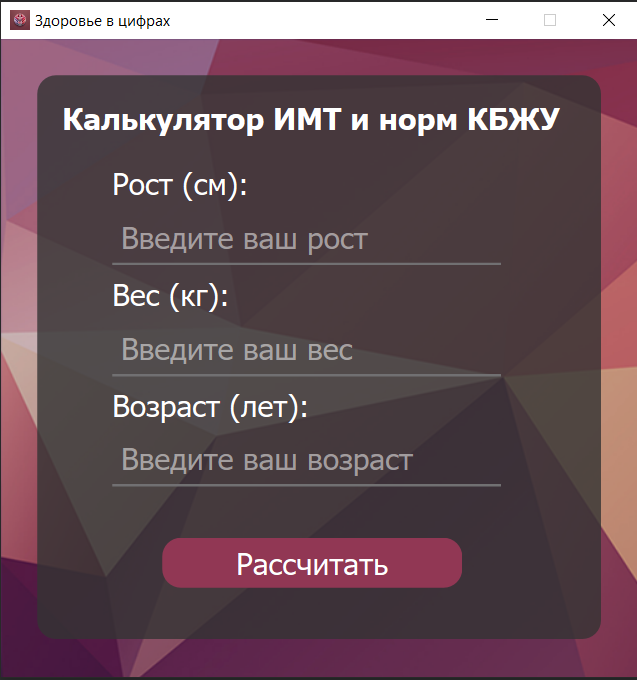
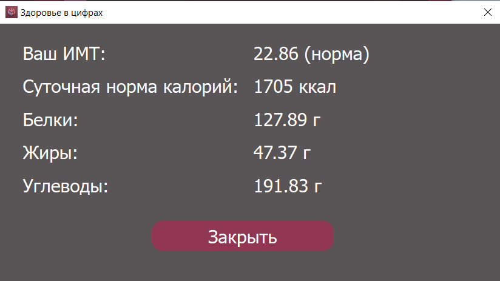
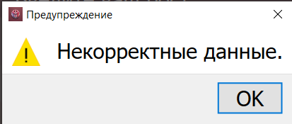

# Здоровье в цифрах

## Описание

Здоровье в цифрах — это приложение, разработанное на C++ с использованием фреймворка Qt. Оно предназначено для расчета Индекса Массы Тела (ИМТ) и норм КБЖУ (калорий, белков, жиров, углеводов) на основе параметров пользователя (рост, вес, возраст).

Приложение предоставляет удобный интерфейс для ввода данных и отображения расчетов по здоровью и питанию.

## Функциональные возможности

- **Расчет ИМТ:** Ввод данных о весе (кг) и росте (см), расчет индекса массы тела.
- **Расчет норм КБЖУ:** Ввод данных о возрасте и получение рекомендаций по ежедневной норме калорий, белков, жиров и углеводов.
- **Простой интерфейс:** Удобное окно для ввода параметров и отображения результатов.

## Пример интерфейса





## Как использовать

### Сборка с помощью CLI

1. Склонируйте репозиторий:
   ```bash
   git clone https://github.com/Er1argh/bmi.git
   ```
2. Создайте директорию для сборки и перейдите в неё:
   ```bash
   mkdir build && cd build
   ```
3. Сгенерируйте Makefile с помощью qmake:
   ```bash
    qmake ..
   ```
4. Соберите проект с помощью make:
   ```bash
   make
   ```
5. Запустите приложение:
   ```bash
   ./Здоровье_в_цифрах
   ```

### Сборка с помощью QtCreator

1. Скачайте или склонируйте проект:
   ```bash
   git clone https://github.com/Er1argh/bmi.git
   ```
2. Откройте проект в QtCreator.
3. Постройте и запустите проект с помощью комбинации клавиш Ctrl + R или Ctrl + Shift + B.

## Требования

- **Язык:** C++
- **Фреймворк:** Qt 6.8.0
- **Компилятор:** MSVC 2022 (64-bit)

## Технологии

- C++
- Qt Framework
- MSVC 2022

## Лицензия

Этот проект лицензирован под лицензией MIT.
